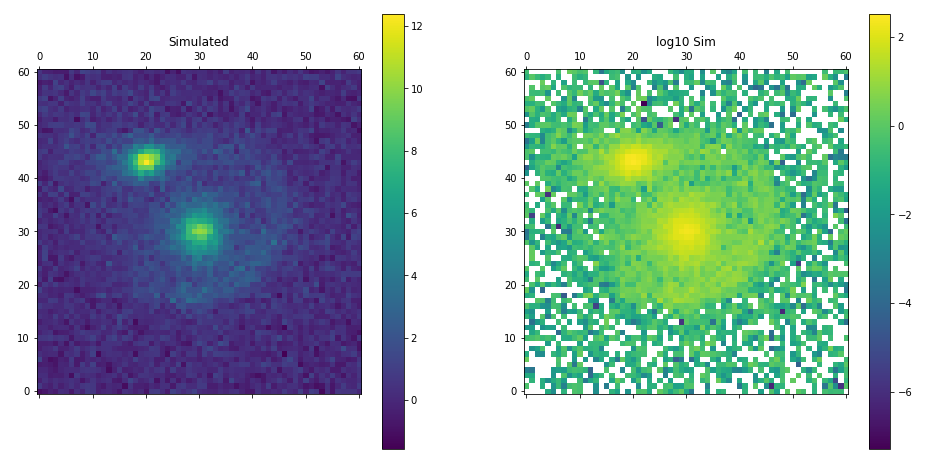

# deepLensing

Lokasi penyimpanan data sementara hasil generate mock Lensing.

Pada folder `data` telah tersedia hasil dalam `.fits` lalu untuk crosscheck hasil fitting bisa melihat data pada `.txt`

Script generator akan diupdate agar lebih kreatif hasilnya.
